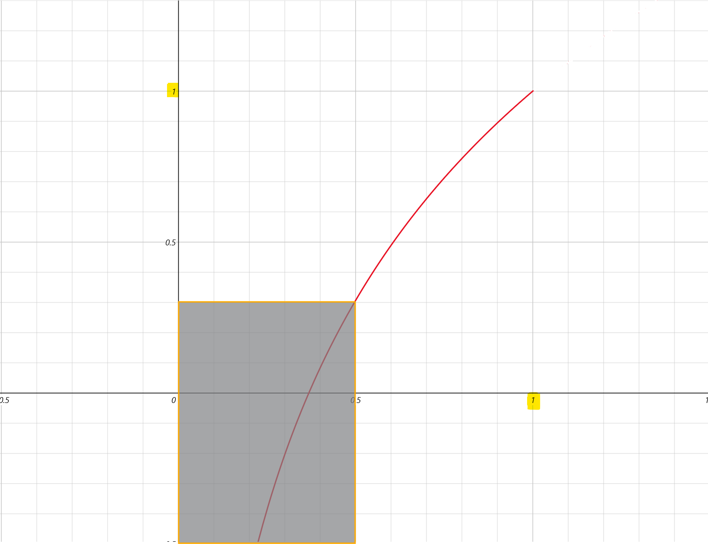
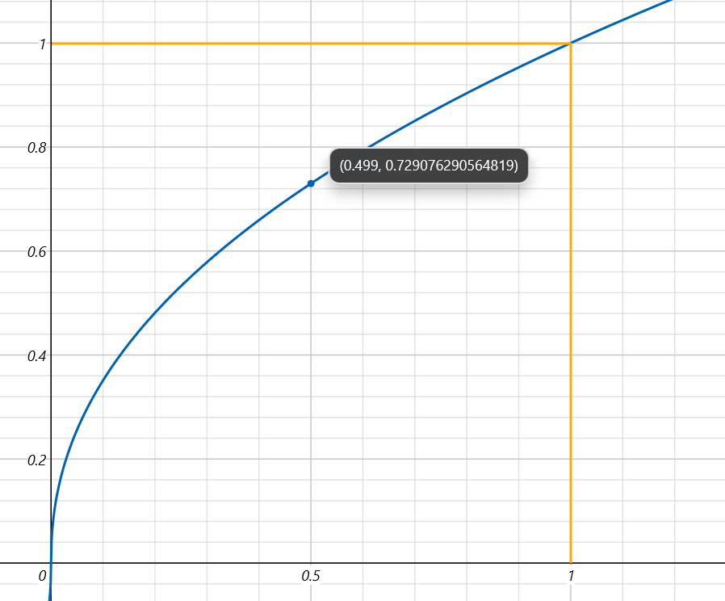

## Gamma 矫正和 sRGB 图像

本节将解释使用 Gamma 矫正和 sRGB 图像的原因。

这里首先展示渲染流程中 **颜色空间** 的变化过程作为前置知识：

```text
纹理图像(sRGB) -> 图形 API 矫正 -> 光照计算  -> Gamma 矫正  -> 显示器显示
----------------------------------------------------------------------
   sRGB空间         线性空间       线性空间     Gamma空间      线性空间
```

### 1. 为什么需要 Gamma 矫正？

由于物理特性和历史遗留，直到现在显示器仍然保留着这样的特性：
将输入亮度（电压）加倍产生的亮度约为输入亮度（电压）的`2.2`次幂。`2.2`被称为显示器 **Gamma** 值。

**Gamma 矫正** 提前将颜色从线性空间映射到 Gamma 空间，再由显示器重新映射回线性空间。

- Gamma 矫正

$$
    I_2 = I_1^{\frac{1}{2.2}}
$$

- 显示器映射

$$
    I_3 = I_2^{2.2}
$$

- 显示结果

$$
    \Rightarrow I_3 = I_1
$$

此过程确保显示亮度和光照计算结果保持线性一致。

### 2. 为什么需要 sRGB 图像？

使用 **sRGB 图像标准** 存在两个明显好处：便利图像创作和提高图像存储效率。

1. 在使用计算机创建图像时，我们通常根据显示器画面来调整颜色，使其更加符合视觉效果。

    例如，在软件中通过调色使一张风景照片显示出来的亮度更符合人眼在现实中感受到的。

    这样得到的图像正是 sRGB 图像：由于显示器 Gamma 的存在，我们在调色过程中无意地对图像进行了一次 Gamma 矫正来达到正确的显示效果。

2. 根据韦伯定律，人眼感受到的物理亮度要增加一倍（比如从0.1到0.2）才会感觉比原来变亮了一倍。

    例如，颜色值从0.1到0.2，我们会感受到一倍的颜色变化，而从0.4到0.8我们才能感受到相同程度（变亮一倍）的颜色变化！

    而对数函数似乎能完美地描述物理亮度和视觉亮度的关系：

    $$
        ln(0.2) - ln(0.1) = ln2 = ln(0.8) - ln(0.4)
    $$

    自然地，我们会选用 $f(x)=lnx + 1$ 来描述两者关系，观察图像：

    （其中横坐标表示物理亮度，纵坐标表示感知亮度）

    

    可以发现，物理亮度的暗部（$0 < x < 0.5$）就已经能映射到视觉亮度的绝大部分区域（阴影部分下边界向下无限延伸）。

    这意味着人眼对现实光线中的暗部有着更大的感知范围，即人眼对暗部变化更加敏感！（相应地，人眼对亮部的变化更不敏感。）

    因此，在图像内存占用不变的情况下，我们希望牺牲部分亮度信息，以此保留更多暗部信息。

    好巧不巧，Gamma 矫正对应的指数函数 $f(x)=x^{\frac{1}{2.2}}$ 正好能够将暗部映射到更大的范围上去，为暗部信息保留了更多存储空间。

    

    所以，存储Gamma矫正后的图像是更加合理的选择：暗部信息被分配到更多的bit去存储。代价是在用于光照计算前需要矫正回线性空间。

    而所谓的“Gamma矫正后的图像”正是 sRGB 图像。

## 法线矩阵的推导

先考虑经**模型矩阵**变换后的切向量。

平面切向量可以表示为面上两点之差：

$$
    \vec{T} = p_a - p_b
$$

将点 $p_a$ 和 $p_b$ 经模型矩阵变换后，根据切线定义，它们之差仍表示该平面的切向量。

$$
\begin{align}
    \vec{T'} &= M p_a - M p_b \\

    &= M (p_a - p_b) \\

    &= M \vec{T}
\end{align}
$$

因此，经模型变换后的切向量 即为模型矩阵乘以原切向量：

$$
    \vec{T'} = M \vec{T} \tag{1}
$$

----

接下来，我们开始推导法线矩阵 $G$。它的作用是正确地将法向量进行模型变换：

$$
    \vec{N'} = G \vec{N} \tag{2}
$$

变换后，由于法向量和切向量始终仍保持垂直，两者内积为 $0$：

$$
    dot (\vec{N'}, \vec{T'}) = 0
$$

将式 $(1)(2)$ 代入，得到：

$$
\begin{align}

    dot(G \vec{N}, M \vec{T}) &= 0 \\

    (G \vec{N})^T (M \vec{T}) &= 0 \\

    (\vec{N^T} G^T) (M \vec{T}) &= 0 \\

    \vec{N^T} G^T M \vec{T} &= 0 \tag{3}

\end{align}
$$

变换前，法向量和切向量保持垂直，两者内积为 $0$：

$$
    dot (\vec{N}, \vec{T}) = \vec{N^T} \vec{T} = 0 \tag{4}
$$

由 $(3)(4)$ 可知：

$$
\begin{align}
    G^T M &= I \\

    G^T M M^{-1} &= M^{-1} \\

    G^T &= M^{-1} \\

    G &= (M^{-1})^T  \tag{5}
\end{align}
$$

式 $(5)$： $G = (M^{-1})^T$ 即为法线矩阵与模型矩阵的转换关系。

## 参考文献

- [LearnOpenGL-CN - Gamma 矫正](https://learnopengl-cn.github.io/05%20Advanced%20Lighting/02%20Gamma%20Correction/)

- [LearnOpenGL-CN - 基础光照](https://learnopengl-cn.github.io/02%20Lighting/02%20Basic%20Lighting/#_6)

- [法线矩阵(Normal Matrix)和TBN矩阵](https://blog.csdn.net/weixin_43789369/article/details/132008366)
