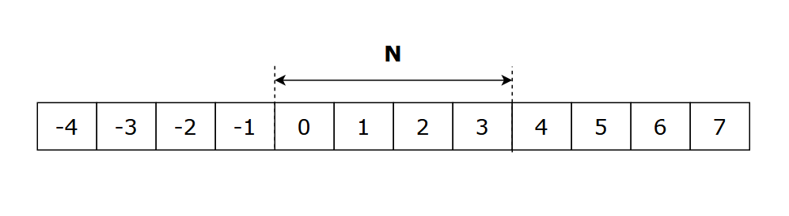

import Callout from '@/components/callout.astro'

## 滑动窗口

- [【算法题单】 滑动窗口与双指针（定长/不定长/单序列/双序列/三指针/分组循环）](https://leetcode.cn/discuss/post/3578981/ti-dan-hua-dong-chuang-kou-ding-chang-bu-rzz7/)

### 定长窗口

- 模板代码

```cpp
// 求定长度子数组最大和

void max_sum(vector<int>& nums, int k) {
    int n = nums.size();
    int sum = 0, ans = 0;
    for (int r = 0; r < n; r++) {
        sum += nums[r];

        int l = r - k + 1;
        if (l < 0) continue;

        ans = std::max(ans, sum);
        sum -= nums[l];
    }
    return ans;
}
```

### 循环数组

惯用技巧是使用拓展数组，其中下标到原数组下标的映射关系为 `i0 = (i + n) % n`。

<div class="flex gap-4 flex-wrap justify-center [&_img,p]:m-0">
  <div class="max-w-2xl">
    
  </div>
</div>

## 数据结构

### 查并集

是用于处理不相交集合合并、查询元素所属集合问题的数据结构。

单次操作的平均时间复杂度为 $O(\alpha{n})$，近似常数时间。

```cpp
class Solution {
private:
    std::vector<int> fa {};
    std::vector<int> rk {};

    void find(int x) {
        if (fa[x] != x)
            fa[x] = find(fa[x]); // 路径压缩
        return fa[x];
    }

    void unite(int a, int b) {
        a = find(a), b = find(b);
        if (a == b) return;
        
        if (rk[a] > rk[b])
            std::swap(a, b);   // 按秩合并

        fa[a] = b;
        if (rk[a] == rk[b])
            rk[b] += 1;
    }
};
```
