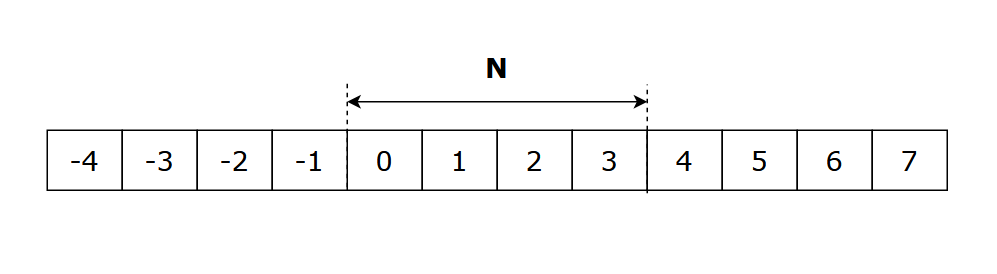

import Callout from '@/components/callout.astro'

## 滑动窗口

- [【算法题单】 滑动窗口与双指针（定长/不定长/单序列/双序列/三指针/分组循环）](https://leetcode.cn/discuss/post/3578981/ti-dan-hua-dong-chuang-kou-ding-chang-bu-rzz7/)

### 定长窗口

- 模板代码

```cpp
// 求定长度子数组最大和

void max_sum(vector<int>& nums, int k) {
    int n = nums.size();
    int sum = 0, ans = 0;
    for (int r = 0; r < n; r++) {
        sum += nums[r];

        int l = r - k + 1;
        if (l < 0) continue;

        ans = std::max(ans, sum);
        sum -= nums[l];
    }
    return ans;
}
```

### 循环数组

惯用技巧是使用拓展数组，其中下标到原数组下标的映射关系为 `i0 = (i + n) % n`。

<div class="flex gap-4 flex-wrap justify-center [&_img,p]:m-0">
  <div class="max-w-2xl">
    
  </div>
</div>

## 数据结构

### 查并集

是用于处理不相交集合合并、查询元素所属集合问题的数据结构。

单次操作的平均时间复杂度为 $O(\alpha{n})$，近似常数时间。

```cpp
class Solution {
private:
    std::vector<int> fa {};
    std::vector<int> rk {};

    void find(int x) {
        if (fa[x] != x)
            fa[x] = find(fa[x]); // 路径压缩
        return fa[x];
    }

    void unite(int a, int b) {
        a = find(a), b = find(b);
        if (a == b) return;
        
        if (rk[a] > rk[b])
            std::swap(a, b);   // 按秩合并

        fa[a] = b;
        if (rk[a] == rk[b])
            rk[b] += 1;
    }
};
```

## 数学

### 模运算

#### 加法/乘法分配恒等式

$$
    (a + b) \bmod m = ((a \bmod m) + (b \bmod m)) \bmod m
$$
$$
    (a \times b) \bmod m = ((a \bmod m) \times (b \bmod m)) \bmod m
$$

#### 负数/减法取模

1. 对于 $x < 0$ 的情况，$(x \bmod m + m) \bmod m$ 保证结果落在 $\left [ 0, m - 1\right ]$
2. 对于减法来说，若 $a - b \ge 0$， 其结果的模应当写成 $((a \bmod m) - (b \bmod m) + m) \bmod m$ 来避免结果为负数。

#### 同余式

1. 对于同余式，特别地有 $m \equiv 0 \pmod m$
2. 在同余式两边乘以同一个整数，同余式仍然成立，即 $ka \equiv kb \pmod m$
3. 在同余式两边加上同一个整数，同余式仍然成立，即 $a \pm k \equiv b \pm k \pmod m$
4. 同余式中的加减法可以移项，如 $a + b \equiv c + d \pmod m \Leftrightarrow a - d \equiv c - b \pmod m$

#### 除法取模

如果 $p$ 是一个质数，$a$ 是 $b$ 的倍数且 $b$ 和 $p$ 互质（即 $b$ 不是 $p$ 的倍数），那么有

$$
    \frac{a}{b} \bmod p = (a \cdot b^{p - 2}) \bmod p
$$

其中，$b^{p - 2}$ 使用快速幂计算。

> 注意: 题目常见的模数 $10^9 + 7$ 是质数。

### 快速幂

```cpp
double pow(double x, int n) {
    double ans = 1;
    if (n < 0) {
        n = -n;
        x = 1 / x;
    }
    while (n) {
        if (n & 1) {
            ans *= x;
        }
        x *= x;
        n >>= 1;
    }
    return ans;
}
```

> 注意：如果 $n = -2^{31}$，那么 $n = -n$ 将会超出32位整数所能表示的最大正数，此时应使用64位整数。
