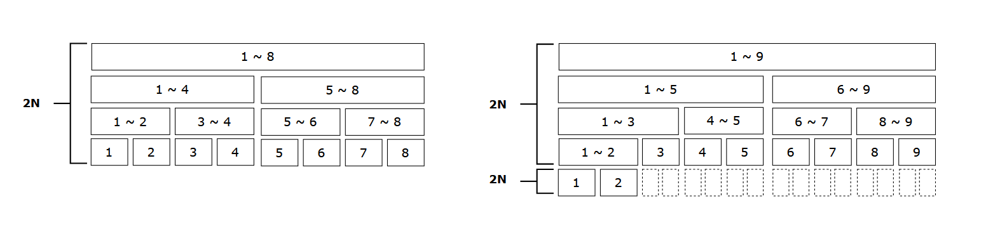

import Callout from '@/components/callout.astro'

时间复杂度参考：[Acwing - 由数据范围反推算法复杂度以及算法内容](https://www.acwing.com/blog/content/32/)。

## 枚举

### 1. 指数型枚举

从 $1 \sim n$ 这 $n$ 个整数中随机选取任意多个，输出所有可能的选择方案。

相关例题：[92. 递归实现指数型枚举](https://www.acwing.com/activity/content/problem/content/1545/)，时间复杂度 $O(n^2)$。

- 递归解法

```cpp
const int N = 15;
bool bt[N];
int n;

void dfs(int x) {
    if (x == n) {
        for (int i = 0; i < n; i++)
            if (bt[i]) printf("%d ", i + 1);
        puts("");
        return;
    }

    bt[x] = true;
    dfs(x + 1);
    bt[x] = false;
    dfs(x + 1);
}

int main() {
    scanf("%d", &n);
    dfs(0);
}
```

- 非递归解法

```cpp
int main() {
    int n;
    scanf("%d", &n);

    for (int i = 0; i < (1 << n); i++) {
        for (int j = 0; j < n; j++) {
            if ((i >> j) & 1)
                printf("%d ", j + 1);
        }
        puts("");
    }
}
```

### 2. 排列型枚举

把 $1 \sim n$ 这 $n$ 个整数排成一行后随机打乱顺序，输出所有可能的次序。

相关例题：[94. 递归实现排列型枚举](https://www.acwing.com/activity/content/problem/content/1548/)，时间复杂度 $O(n!)$。

```cpp
const int N = 10;
int n;
bool bt[N];
int res[N];

void dfs(int x) {
    if (x == n) {
        for (int i = 0; i < n; i++)
            printf("%d ", res[i]);
        puts("");
        return;
    }

    for (int i = 1; i <= n; i++) {
        if (!bt[i]) {
            bt[i] = true;
            res[x] = i;
            dfs(x + 1);
            bt[i] = false;
        }
    }
}

int main() {
    scanf("%d", &n);
    dfs(0);
}
```

### 3. 组合型枚举

从 $1 \sim n$ 这 $n$ 个整数中随机选出 $m$ 个，且同一行内的数升序排列，对于相邻任意两行要求字典序较小的排在前面，输出所有可能的选择方案。

相关例题：[93. 递归实现组合型枚举](https://www.acwing.com/activity/content/problem/content/1547/)。

- 递归解法

```cpp
const int N = 25;
int n, m;
int res[N];

void dfs(int i, int x) {
    if (i == m) {
        for (int j = 0; j < m; j++)
            printf("%d ", res[j]);
        puts("");
        return;
    }

    for (int j = x; j <= n; j++) {
        res[i] = j;
        dfs(i + 1, j + 1);
    }
}

int main() {
    scanf("%d%d", &n, &m);
    dfs(0, 1);
}
```

- 非递归解法（Gosper's Hack）

```cpp
int main() {
    int n, k;
    cin >> n >> k;
    
    k = n - k;
    
    int cur = (1 << k) - 1;
    int limit = cur << (n - k);
    
    while (cur <= limit) {
        for (int i = 1; i <= n; i++) {
            if (!(cur & (1 << n - i)))
                cout << i << " ";
        }
        cout << endl;
        
        int lb = cur & -cur;
        int r = cur + lb;
        cur = ((r ^ cur) >> __builtin_ctz(lb) + 2) | r;
    }
}
```

## 递推

*TODO*

## 二分查找

针对 **有序（单调）** 的（离散或连续）数据集合的查找算法。

时间复杂度：$O(\log{n})$

- 模板代码

```cpp
// 针对递增的有序数组

int lowerbound(int left, int right) {
    int l = 0, r = N - 1;
    while (l < r) {
        int mid = (l + r) >> 1;

        if (arr[mid] < target)
            l = mid + 1;
        else
            r = mid;
    }

    return l;
}

int upperbound(int left, int right) {
    int l = 0, r = N - 1;
    while (l < r) {
        int mid = (l + r + 1) >> 1;
        if (arr[mid] > target)
            r = mid - 1;
        else
            l = mid;
    }
    return l;
}
```

<Callout>
    `mid = (l + r) >> 1` 执行下取整除法，最坏情况结果为 `l` 本身，因此在出现 `l = mid` 时应该采用 `mid = (l + r + 1) >> 1` 上取整除法来使得 `l` 总能增大来避免死循环。
</Callout>

相关例题：

- [789. 数的范围](https://www.acwing.com/activity/content/problem/content/1566/) （离散数据）

- [790. 数的三次方根](https://www.acwing.com/activity/content/problem/content/1567/) （连续数据）

## 前缀和

*TODO*

## 动态规划

*TODO*

## 归并排序

时间复杂度为 $O(n\log{n})$ 的排序算法，可拓展解决 **逆序对问题**。

时间复杂度：$O(n\log{n})$

空间复杂度：$O(n)$

- 模板代码

```cpp
const int N = 1e5 + 10;
int s[N]; // 原数组
int t[N]; // 临时数组

void mergeSort(int left, int right) {
    if (left == right) return;

    int mid = (left + right) >> 1;
    mergeSort(left, mid);
    mergeSort(mid + 1, right);

    int cur = left;
    int l = left, r = mid + 1;
    while (l <= mid && r <= right) {
        if (s[l] <= s[r]) t[cur++] = s[l++];
        else t[cur++] = s[r++];
    }

    while (l <= mid)
        t[cur++] = s[l++];
    while (r <= right)
        t[cur++] = s[r++];

    for (int i = left; i <= right; i++)
        s[i] = t[i];
}
```

相关例题：

- [787. 归并排序](https://www.acwing.com/activity/content/problem/content/1601/)

- [788. 逆序对的数量](https://www.acwing.com/activity/content/problem/content/1606/)

- [1215. 小朋友排队](https://www.acwing.com/activity/content/problem/content/1722/)

## 树状数组

树状数组特是一种特殊的数据结构，特化为解决线段树可解问题集合的一个特定子集，即 **动态单点修改后求和**。

树状数组解题代码量和运行时间均低于线段树，故解决上述问题优先使用该数据结构。

树状数组使用长度为 $N$ 的数组存储，支持 **单点修改** 和 **区间求和**。

存储结构利用了索引编号二进制表示低位的周期规律性。

时间复杂度：均为 $O(\log{n})$

空间复杂度：$O(n)$

相关例题：[1264. 动态求连续区间和](https://www.acwing.com/activity/content/problem/content/1719/)。

- 模板代码

```cpp
/** NOTE: 树状数组与原数组
*   1. 数组长度一致
*   2. 索引均从 `1` 开始计数
*/

const int N = 110;
int tr[N];
int n; // 原数组长度

int lowbit(int x) {
    return x & -x;
}

void add(int x, int v) {
    for (int i = x; i <= n; i += lowbit(i))
        tr[i] += v;
}

// Query sum of (l, r]
int query(int l, int r) {
    if (l == 0) {
        int res = 0; // FIXME Use `long long` instead
        for (int i = r; i > 0; i -= lowbit(i))
            res += tr[i];
        return res;
    }
    return query(0, r) - query(0, l);
}
```

## 线段树

线段树可解决 **动态单点修改后求和** 和 **区间最值问题** 问题，可拓展为 **扫描线算法**。

线段树使用长度为 $4N$ 的数组存储，支持 **单点修改** 和 **区间查询** 操作（可使用懒标记实现区间修改 *TODO*）。

时间复杂度：均为 $O(\log{n})$

空间复杂度：$O(n)$

- 解释数组长度为 $4N$ 的图例

<div class="flex gap-4 flex-wrap justify-center [&_img,p]:m-0">
  <div class="max-w-2xl">
    
  </div>
</div>

相关例题：

- 动态修改求和：[1264. 动态求连续区间和](https://www.acwing.com/activity/content/problem/content/1719/)

- 区间最值问题：[1270. 数列区间最大值](https://www.acwing.com/activity/content/problem/content/1721/)

- 扫描线算法：[1228. 油漆面积](https://www.acwing.com/activity/content/problem/content/1723)

## 差分

差分是前缀和的逆运算，通过记录差值来使得区间修改操作时间复杂度降低至 $O(1)$。

时间复杂度：修改操作 $O(1)$，查询操作 $O(n)$

空间复杂度：$O(n)$

使用差分算法的一般步骤为：

1. 计算差分数组

2. 将区间修改转换为对差分数组的修改

3. 求前缀和获取修改后结果

其中，可以先写出（对差分数组，即原数组的）前缀和公式，再通过移项得到差分公式。

相关例题：

- 一维差分：[797. 差分](https://www.acwing.com/activity/content/problem/content/1736/)

- 二维差分：[798. 差分矩阵](https://www.acwing.com/activity/content/problem/content/1737/)

- 三维差分：[1232. 三体攻击](https://www.acwing.com/activity/content/problem/content/1724/)

## 双指针

*TODO*

## 图论

### 存储方式

- 邻接表（以树为例）

```cpp
const int N = 1e5; // 顶点数
const int M = 2 * N; // 边数

int w[N]; // 顶点权值
int h[M], e[M], ne[M], idx;

// 初始化图
void init() {
    idx = 0;
    memset(h, -1, sizeof(h));
}

// 添加一条 a -> b 的边
void add(int a, int b) {
    e[idx] = b， ne[idx] = h[a], h[a] = idx++;
}

void dfs(int u, int parent) {
    for (int i = h[i]; i != -1; i = ne[i]) {
        if (i == parent) continue;
        dfs(e[i], u);
        printf("%d ", w[e[i]]);
    }
}
```

相关例题：

- [1220. 生命之树](https://www.acwing.com/activity/content/problem/content/1807/)

- [826. 单链表](https://www.acwing.com/activity/content/problem/content/1759/)

## 贪心

*TODO*

## 数论

### 1. 最大公约数

- 欧几里得算法

```cpp
int gcd(int a, int b) {
    return b ? gcd(b, a % b) : a;
}
```

相关例题：[1246. 等差数列](https://www.acwing.com/activity/content/problem/content/1796/)

### 2. 质数问题

#### 算数基本定理

任何一个大于 $1$ 的自然数 $N$，如果 $N$ 不为质数，那么 $N$ 可以唯一分解成有限个质数的乘积，即

$$
    N = P^{\alpha_1}_1 \times P^{\alpha_2}_2 \times \ldots \times P^{\alpha_k}_k
$$

其中 $\alpha_i \ge 0$。

#### 筛法求质数

求 $1 \sim n$ 中所有质数，以及 $1 \sim n$ 中各数的最小质因子。

时间复杂度：$O(n)$

- 模板代码

```cpp
const int N = 1010;
// 所有质数集合
int primes[N], cnt;
// i 的最小质因子表
int minp[N];
bool st[N];

void get_primes(int n) {
    for (int i = 1; i <= n; i++) {
        if (!st[i]) primes[cnt++] = i, minp[i] = i;
        for (int j = 0; primes[j] * i <= n; j++) {
            st[primes[j] * i] = true;
            minp[primes[j] * i] = primes[j];
            if (i % primes[j] == 0) break;
        }
    }
}
```

相关例题：[1295. X的因子链](https://www.acwing.com/activity/content/problem/content/1797/)

## 数学结论

1. 多重集排列数

$$
    N = \frac{(n_1 + n_2 + \ldots + n_k)!}{n_1! + n_2! + \ldots + n_k!}
$$

2. 约数问题

设 $N$ 为自然数，即 $N = P^{\alpha_1}_1 \times P^{\alpha_2}_2 \times \ldots \times P^{\alpha_k}_k$，那么

其约数总数为 $(\alpha_1 + 1)(\alpha_2 + 1) \ldots (\alpha_k + 1)$，

约数之和为 $(1 + P_1 + P^2_{1} + \ldots + P^{\alpha_1}_1)(1 + P_2 + P^2_{2} + \ldots + P^{\alpha_2}_2) \ldots (1 + P_k + P^2_{k} + \ldots + P^{\alpha_k}_k)$。
